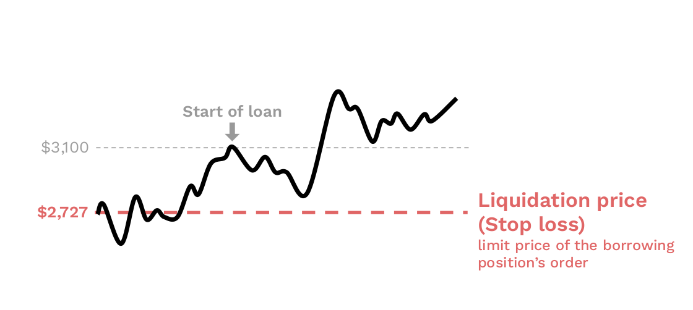

<h2 style="font-weight: bold;">Check out the market price</h2>

By choosing the pool-of-orders from which the borrower borrows, he therefore chooses the price at which he wishes to be liquidated. 
**To avoid liquidation, the borrower simply needs to follow the market price and remember at what limit price he has placed his loan.**

<figure markdown>
  
  <em>Borrowers set the prices at which their positions are closed for a loss.</em>
</figure>

<h2 style="font-weight: bold;">Check out your excess collateral</h2>

If the borrower doesn't want to over-collateralize his loan, he can track his [excess collateral](../../how-it-works/liquidation){target=_blank} and when his excess collateral falls below a given threshold, he can repay his loan or add more collateral.
