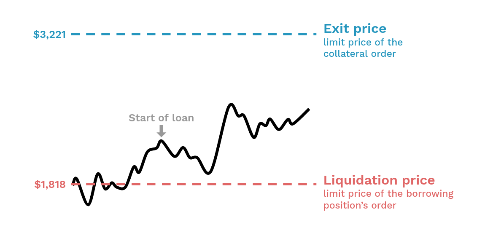

<h2 style="font-weight: bold;">Check out the market price</h2>

The borrower chooses the pool-of-orders to borrow from. He therefore chooses the price at which he wishes to be liquidated. 
**The borrower simply has to follow the market price and remember at which limit price he put his loan.**

<figure markdown>
  
  <em>Borrowers set the prices at which their positions are closed for a loss and for a profit.</em>
</figure>

<h2 style="font-weight: bold;">Check out your excess collateral</h2>

If the borrower doesn't want to bother, he can calculate the maximum interest rate he would need over a desired period of time, and adds this amount to the collateral he has already deposited. There will be a tab in the dapp to calculate this easily.

Alternatively, if the borrower doesn't want to over-collateralize his loan, **he can track his [excess collateral](../../how-it-works/liquidation){target=_blank} and add collateral when his excess collateral falls below a given threshold.**