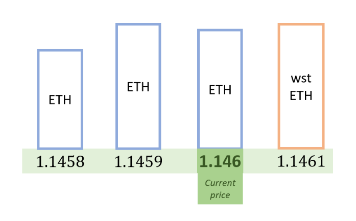

LendBook is exceptionally well-suited for yield amplification in markets with pegged assets in which one is a yield-bearing version of the other. 

Let us illustrate the efficiency of LendBook with an example taken in the liquid staking derivative markets. The Uniswap V3 market wstETH/ETH is endowed with 27m liquidity with capital spread between prices 1.1458 and 1.1461 ([observed on Nov. 13th 2023](https://info.uniswap.org/#/pools/0x109830a1aaad605bbf02a9dfa7b0b92ec2fb7daa){target=_blank}). Assuming a similar liquidity distribution on LendBook, the order book representation is :

<figure markdown>
  
  <em>Capital distribution in the wstETH/ETH market similar to the Uniswap liquidity pool.</em>
</figure>

A strategy amplifying the yield consists in depositing wstETH on the sell order side and borrowing ETH on the buy order side. Given a market price of 1.146, borrowing ETH at the limit price of 1.1458 would give users a LTV of 97.98% (=0.98 × 1.1458/1.1460). Exchanging on Uniswap the ETH for wstETH at a 0.01% fee rate would provide traders with an adjusted LTV of 97.97% (assuming no price impact). If the process could be infinitely repeated, the maximum leverage factor would be x49.

In practice, the leverage factor will be less due to a finite number of rounds of borrowing. For a leverage factor of 30, given a wstETH APR of 3.9% and a borrow APY of 3%, leveraged APR would be 27% (=30 × 0.9%)