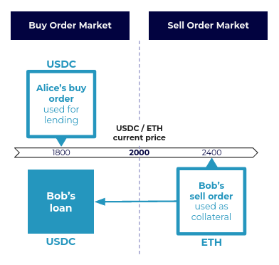

## **Main Logic**

Users can lend and borrow limit orders' assets :

* Lenders post limit orders which can be borrowed.

* Borrowers place limit orders as collateral on the other side of the order book

→ If price drops to buy price, liquidation occurs and collateral is transferred to lenders.

<figure markdown>
  { width="400" }
  <figcaption>(1) Alice posts a buy order at price 1800 USDC. (2) Bob places some ETH as a sell order at 2400. With this ETH as collateral, he can then borrow USDC from Alice.</figcaption>
</figure>

## **Market participants**

## **Notion of pool-of-orders**

faire une belle figure

## **Rules**

## **Interest rates**

## **TBD**