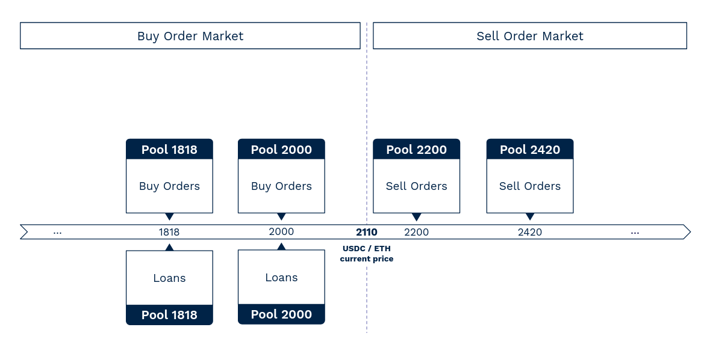

## **Market participants**

There are three different types of market participants :

* **Lenders :** They post limit orders at specified prices. These orders can be borrowed, which earns them interest.
* **Borrowers :** They post limit orders at specified prices on the other side of the order book. They earn interest rates when orders are borrowed. 
* **Takers :** They take limit orders which are in the LLOB. 

## **Notion of pool-of-orders**

Lendbook is inspired by the logic of an order book, but it is not designed to replace traditional limit order book. To avoid diluting the lending liquidity across all possible prices, **we introduce the notion of pools of limit orders.**

**Lenders and borrowers can place orders within a restricted range of limit prices.** All orders placed at the same limit price belong to the same pool of orders. **Each pool has its own limit price and each pool is equally spaced by a multiplication factor.** 

This multiplication factor is unique for each pair of assets and it is defined at market creation. The value of this factor depends on the nature and volatility of the assets. **If the assets are volatile, the factor will be set as high** (e.g. step of 15% between each pool). **If the assets are correlated or pegged, the factor will be set as low** (e.g. step of 1% between each pool).

_For example, for the ETH/USDC market, the step between each pool can be defined as 10%. If the current price is 2110, the 4 pools that are close to this price are: 1818, 2000 (=1818x1.10), 2200 (=2000x1.10), and 2420 (=2200x1.1). Alice may deposit assets in buy orders at limit prices 2000, 1818 (or even under) but not between 2000 and 1818. And Bob can deposit his collateral in sell orders at limit prices of 2200, 2420 or even above._

<figure markdown>
  
</figure>

## **Rules**

## **Interest rates**

## **TBD**