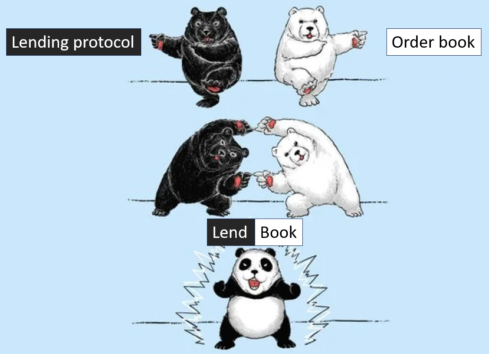

[//]: <> (<h2 style="font-weight: bold;">What is a LendBook ?</h2>)
## **What is a LendBook ?**

LendBook is a **Lending Limit Order Book (LLOB)**. It's a non-custodial and permissionless lending protocol that enables users to borrow limit orders’ assets collateralized by their own limit orders. 

In other words, it can be seen as the fusion of a Limit Order Book and a lending protocol.

<figure markdown>
  { width="400" }
</figure>

## **Advantages**

This new financial primitive offers users multiple benefits: 

* stop loss orders with guaranteed stop price
* low liquidation penalty
* high loan-to-value and leverage
* interest-bearing limit orders. 

The protocol is immune to the risk of bad debt, there is no off-chain risk management.
