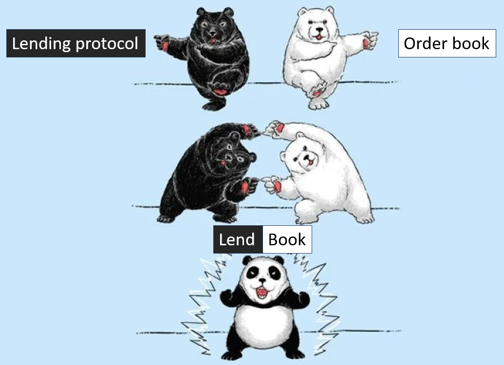
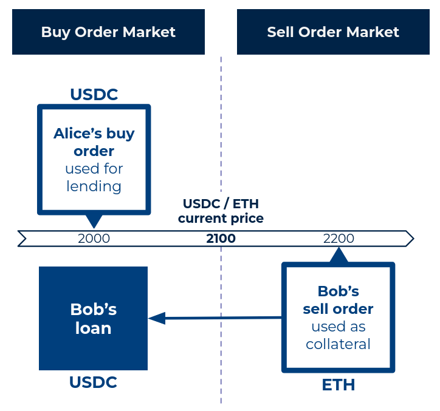

[//]: <> (<h2 style="font-weight: bold;">What is a LendBook ?</h2>)

LendBook is a **Lending Limit Order Book (LLOB)**. It's a non-custodial and permissionless lending protocol that enables users to borrow limit orders’ assets collateralized by their own limit orders. 

In other words, it can be seen as the fusion of a Limit Order Book and a lending protocol.

<figure markdown>
  { width="400" }
</figure>

## **Main Logic**

Users can lend and borrow limit orders' assets :

* Lenders post limit orders at specified prices. These orders can be borrowed.
* Borrowers place limit orders as collateral on the other side of the order book.
* When part or all of the assets for a specific order price are taken, the positions borrowing against those orders are liquidated. Collaterals are thus transferred to the lenders.

<figure markdown>
  { width="400" }
  <figcaption>(1) Alice posts a buy order at price 1800 USDC. (2) Bob places some ETH as a sell order at 2400. With this ETH as collateral, he can then borrow USDC from Alice.</figcaption>
</figure>

## **Advantages from existing lending protocols**

It makes a huge difference compared to existing lending protocols. This new financial primitive offers users multiple benefits: 

* **stop loss orders with guaranteed stop price**
* **low liquidation penalty**
* **high loan-to-value and leverage**
* **interest-bearing limit orders**

The protocol is immune to the risk of bad debt, there is no off-chain risk management.
