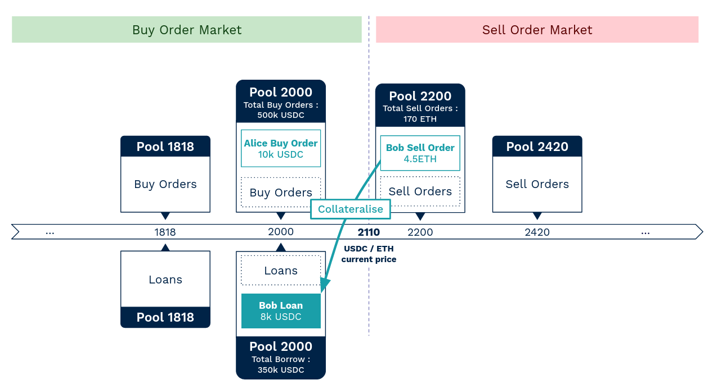

Borrowers who borrow from a pool pay interest rates to the lenders in that same pool.

**The interest rate is calculated per pool of orders**, and **it depends on the pool's utilisation rate**. Interest rates are shared between all the lenders of a pool.

<h2 style="font-weight: bold;">Calcul of the Utilisation Rate</h2>

**The liquidity** deposited by lenders in a pool **can be divided into different categories :**

- **Non-Borrowable liquidity** : Liquidity which is not available for borrowing. It is left to incentivize takers to make a trade when the market price reaches the limit price. Indeed, the first trade of a taker is important because it activates the liquidation of all the borrowing positions from the pool. The ratio of the non-Borrowable liquidity is defined at the smart contract level (e.i. 10% of the liquidity).
- **Borrowable liquidity** :
    - **Borrowed liquidity** : Borrowable assets which are currently borrowed.
    - **Available Liquidity** : Borrowable assets which are not yet borrowed. Borrowing or withdrawing from the pool reduces available liquidity.

 
**The Utilisation Rate (UR) is calculated per pool of orders**. UR is the ratio between the Borrowed liquidity and the total of Borrowable liquidity :

$UR = \dfrac{Borrowed\ liquidity}{Borrowed\ liquidity + Available\ liquidity}$

<!-- https://katex.org/docs/supported.html#binary-operators -->

 

The UR has a maximum value of 100%. As long as UR is not equal to 100%, borrowers can borrow more, and lenders can withdraw their limit orders (before their orders are executed).

<h2 style="font-weight: bold;">Calcul of the Interest Rate</h2>

The higher the pool’s utilization rate (UR), the higher the **Interest Rate (IR)**.

The optimal utilization of a pool-of-orders is when most of the liquidity is borrowed, but lenders can still withdraw their orders and new borrowers can borrow from the pool. In order to achieve this, the borrowers’ interest rate (IR) curve is split in two parts around the **optimal utilization rate (UR^∗^)**. When the UR is under the UR^∗^, the IR slope is small. And when UR is above, it increases sharply.

<figure markdown>
  
</figure>

??? info "Equation of the Interest Rate curve"
    The IR curve is :
    

    $\begin{cases}
        if\ \ UR \leq UR^*\ ;\ IR = \alpha+\beta \dfrac{UR}{UR^*} \\ 
        if\ \ UR \gt UR^*\ ;\ IR = \alpha+\beta +\gamma \dfrac{UR-UR^*}{1-UR^*}
        \end{cases}$
    

    

    $with\ α,\ β\ and\ γ\ three\ positive\ parameters\ (γ>β)$
    

The goal of the IR curve is to encourage new lenders to come and deposit liquidity into the pool when the IR is high in that pool. Or alternately, encourage borrowers to repay their debt in order to increase available liquidity and push the UR back below the UR^*^.

 

!!! note "Example (continued from example in [Pools of orders Section](../pools-of-orders))"
    For the ETH/USDC market, Bob had borrowed 8k USDC from the Pool~2000~.

    For the Pool~2000~, let's calculate the Utilisation Rate and the Interaste Rate:
    
    <figure markdown>
      
    </figure>
    
    
    <figure markdown>
      
    </figure>
    
    :material-arrow-right: So Bob have to pay an Interest Rate equals to 3.69%.