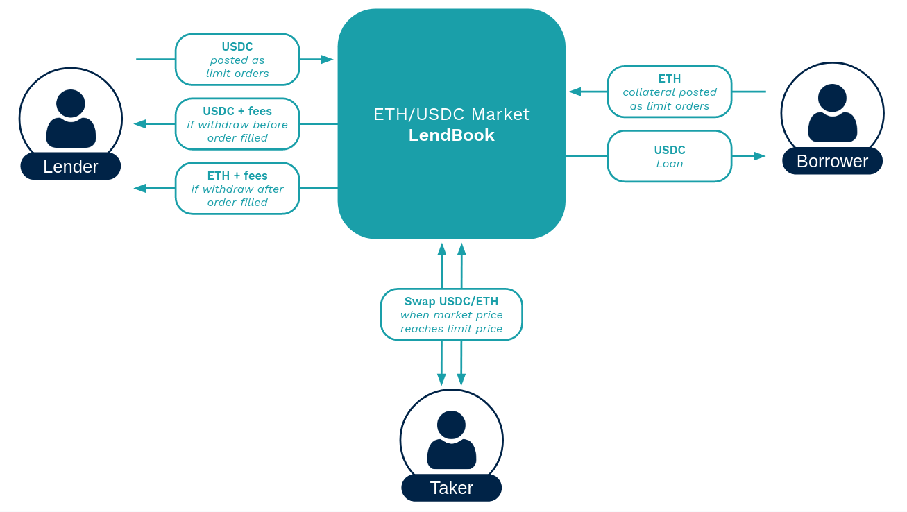

There are three types of market participants in LendBook: **lenders**, **borrowers**, and **takers**.

<figure markdown>
  
  <em>This diagram encapsulates the relationship of the market participants and LendBook, for a ETH/USDC market (Here lenders can lend USDC, borrowers can borrow USDC with ETH as collateral, and takers can trade USDC for ETH and vice versa).</em>
</figure>

* **Lenders :** 

    They post limit orders at specified prices. These orders can be borrowed, which earns them interest.

    [:octicons-info-16: More information on lenders](../../users/lender){ .md-button }

 

* **Borrowers :** 

    They post limit orders at specified prices on the other side of the order book. 

    They pay interest rates when orders are borrowed. 

    [:octicons-info-16: More information on borrowers](../../users/borrower){ .md-button }
    
 

* **Takers :** 

    They can trade assets when market price reaches the limit price of orders they want to take.  They can take all or a portion of the non-borrowed part of limit orders. No fees applied on the trade. 
    
    [:octicons-info-16: More information on takers](../../users/taker){ .md-button }

 

