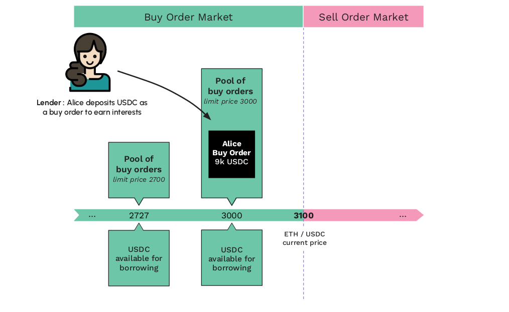
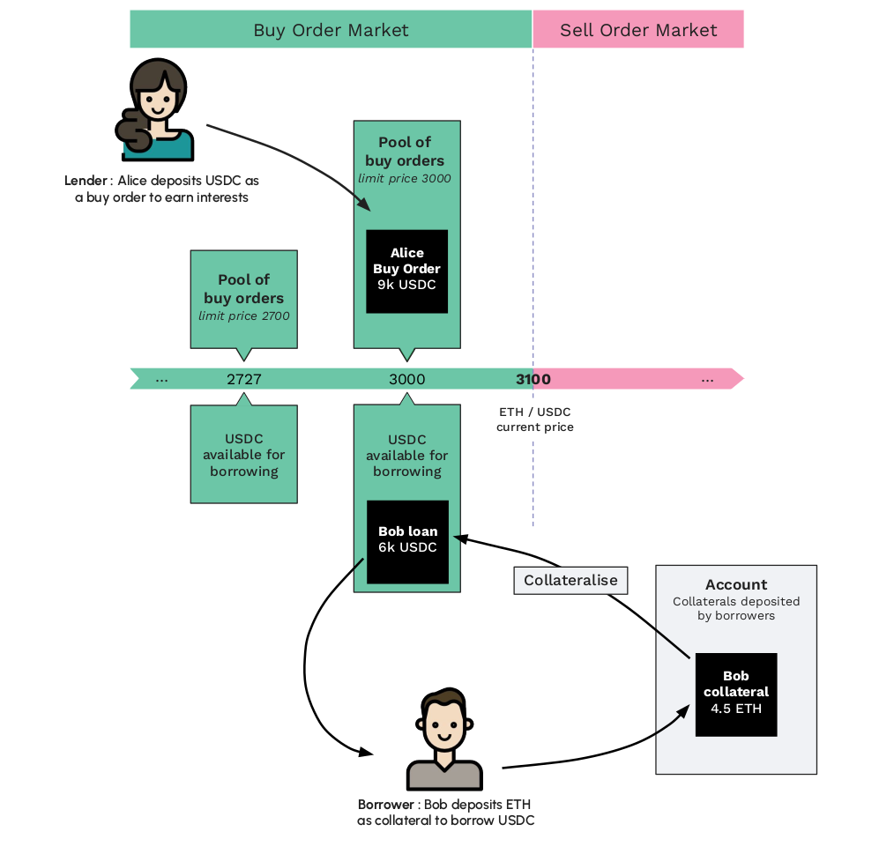

Lendbook is inspired by the logic of an order book, but it is not designed to replace traditional limit order book. To avoid diluting the lending liquidity across all possible prices, **we introduce the notion of pools of limit orders.**

**Lenders place orders within a restricted set of limit prices.** All orders placed at the same limit price belong to the same pool of orders. **Pools have their own limit price and are equally spaced by a multiplication factor.** 

The interest rate is calculated per pool. It depends on the pool's utilization rate. **Borrowers who borrow from a pool pay interest rates to the lenders in that same pool.**

This multiplication factor is unique for each pair of assets and it is defined at market creation. The value of this factor depends on the nature and volatility of the assets. **If the assets are volatile, the factor will be set as high** (e.g. step of 15% between each pool). **If the assets are correlated or pegged, the factor will be set as low** (e.g. step of 1% between each pool).

!!! note "Example"
    For the ETH/USDC market, the step between each pool is defined as 10% (meaning ×1.10).
    
    Assuming the market price is 3100, the pools that are close to this price are : 

    - Pool~3000~ with a limit price of 3000, 
    - Pool~2727~ with a limit price of 2727 (=3000/1.10), 
    - Pool~2479~ with a limit price of 2479 (=2727/1.10), 
    - and so on ...

    :material-numeric-1-circle: Depending on Alice's strategy, Alice can deposit assets in buy orders at limit prices of 3000 or 2727 or even under (but not in between). 
    

    <figure markdown>
      
    </figure>
    
     

    :material-numeric-2-circle: Then, Bob deposits collateral in the protocol. Depending on his strategy, Bob can choose to borrow from the Pool~3000~ or the Pool~2727~ (or even under) :

    <figure markdown>
      
    </figure>

