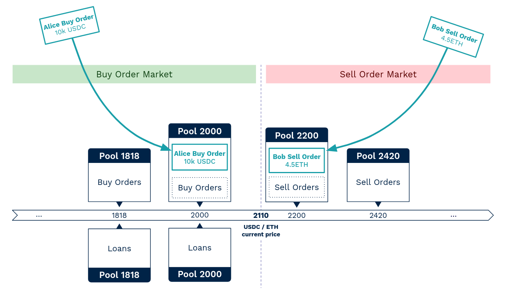
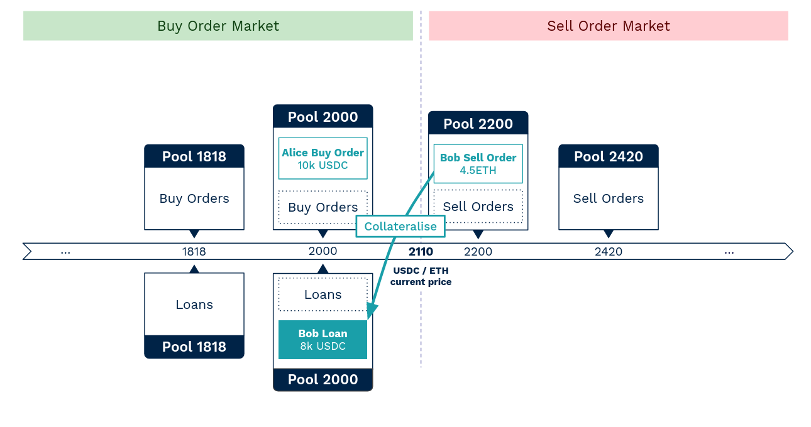

Lendbook is inspired by the logic of an order book, but it is not designed to replace traditional limit order book. To avoid diluting the lending liquidity across all possible prices, **we introduce the notion of pools of limit orders.**

**Lenders and borrowers can place orders within a restricted range of limit prices.** All orders placed at the same limit price belong to the same pool of orders. **Each pool has its own limit price and each pool is equally spaced by a multiplication factor.** 

This multiplication factor is unique for each pair of assets and it is defined at market creation. The value of this factor depends on the nature and volatility of the assets. **If the assets are volatile, the factor will be set as high** (e.g. step of 15% between each pool). **If the assets are correlated or pegged, the factor will be set as low** (e.g. step of 1% between each pool).

The interest rate is calculated per pool. It depends on the pool's utilisation rate. **Borrowers who borrow from a pool pay interest rates to the lenders in that pool.**

!!! note "Example"
    For the ETH/USDC market, the step between each pool is defined as 10% (meaning x1.10).
    
    Assuming the market price is 2110, the 4 pools that are close to this price are : 1818, 2000 (=1818x1.10), 2200 (=2000x1.10), and 2420 (=2200x1.10). 

    :material-numeric-1-circle: Depending on Alice's strategy, Alice can deposit assets in buy orders at limit prices of 2000 or 1818 or even under (but not in between). 
    
    :material-numeric-2-circle: And depending on Bob's strategy, Bob can deposit his collateral in sell orders at limit prices of 2200 or 2420 or even above (but not in between).

    <figure markdown>
      
    </figure>
    
     

    :material-numeric-3-circle: Then, still depending on Bob's strategy, Bob can choose to borrow from the "pool 2000" or the "pool 1818" (or even under) :

    <figure markdown>
      
    </figure>

