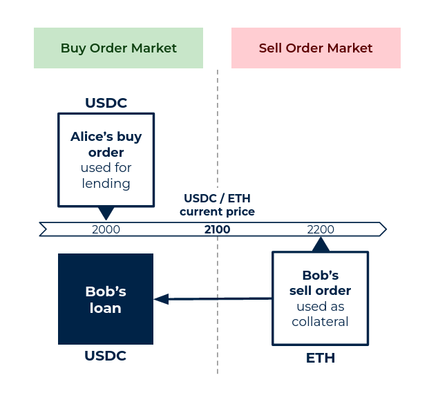

[//]: <> (<h2 style="font-weight: bold;">What is a LendBook ?</h2>)
<!-- commentaire -->

LendBook is a **Lending Limit Order Book (LLOB)**. It's a non-custodial and permissionless lending protocol that enables users to borrow limit orders’ assets collateralized by their own limit orders. 

In other words, it can be seen as **the fusion of a limit order book and a lending protocol**.

<figure markdown>
  { width="400" }
</figure>

**What is a limit order book?**

A limit order book is a list that shows all buy and sell orders for assets like cryptocurrencies (e.g. USDC and ETH). People place orders to buy or sell at specific prices, and these orders are displayed in the list. The highest buyer's price and lowest seller's price are at the top of the list. When a buyer and seller agree on a price, a trade happens, updating the order book. It's a dynamic marketplace, showing asset supply and demand at various price levels.

**What is a lending protocol?**

With a lending protocol in Decentralised Finance, you can lend or borrow money using cryptocurrencies. If you have extra cryptocurrency, you can lend it, and if you need money, you can borrow it. How much you can borrow depends on the amount of cryptocurrency you provide as collateral. Smart contracts on blockchain manage the loans, and borrowers pay interest to lenders.  It's a way to earn interest on your crypto or get a loan without involving centralised financial institutions.

## **Main Logic**

Users can lend and borrow limit orders' assets :

* Lenders post limit orders at specified prices. These orders can be borrowed.
* Borrowers place limit orders as collateral on the other side of the order book in order to borrow assets posted by lenders.
* If the market price reaches the limit price of a lender's order, lender's order is filled, the positions borrowing against this order are liquidated and the collateral is transferred to the lender.

<figure markdown>
  
  <figcaption>(1) Alice posts a buy order at price 1800 USDC. (2) Bob places some ETH as a sell order at 2400. With this ETH as collateral, he can then borrow USDC from Alice.</figcaption>
</figure>

